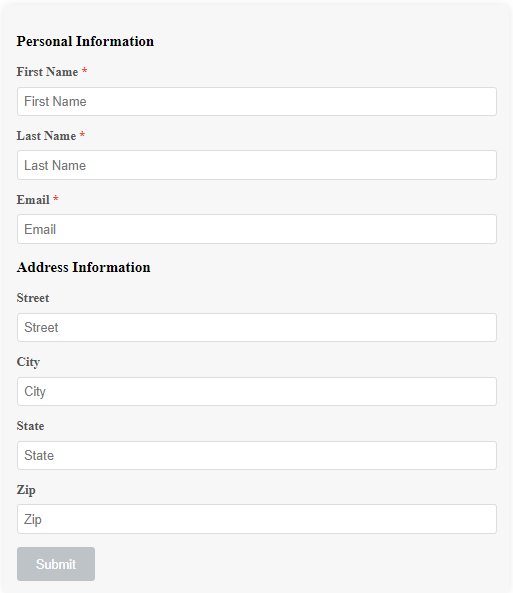

Certainly! Here's a comprehensive README file template for your Angular Dynamic Form Handling project:

---

# Angular Dynamic Form Handling



Angular Dynamic Form Handling is a project designed to simplify form management by dynamically generating and handling form fields based on a structured configuration. This repository provides a flexible solution for managing complex forms in Angular applications.

## Table of Contents

- [About](#about)
- [Features](#features)
- [Getting Started](#getting-started)
  - [Prerequisites](#prerequisites)
  - [Installation](#installation)
- [Usage](#usage)
- [Contributing](#contributing)
- [License](#license)
- [Acknowledgements](#acknowledgements)

## About

Angular Dynamic Form Handling simplifies the process of creating and managing dynamic forms within Angular applications. It allows developers to define form layouts and validations through a configuration-driven approach, enhancing flexibility and maintainability.

## Features

- **Dynamic Form Generation:** Define form fields and layouts programmatically.
- **Validation Support:** Easily integrate validation rules such as required fields.
- **Flexible Configuration:** Customize form behavior and appearance through configuration options.

## Getting Started

To get a local copy up and running follow these simple steps.

### Prerequisites

Ensure you have the following installed:
- Node.js
- Angular CLI

### Installation

1. Clone the repository:
   ```sh
   git clone https://github.com/your-username/angular-dynamic-Form-Handling.git
   ```
2. Navigate into the project directory:
   ```sh
   cd angular-dynamic-Form-Handling
   ```
3. Install dependencies:
   ```sh
   npm install
   ```

## Contributing

Contributions are what make the open-source community such an amazing place to learn, inspire, and create. Any contributions you make are **greatly appreciated**.

1. Fork the project.
2. Create your feature branch:
   ```sh
   git checkout -b feature/AmazingFeature
   ```
3. Commit your changes:
   ```sh
   git commit -m 'Add some AmazingFeature'
   ```
4. Push to the branch:
   ```sh
   git push origin feature/AmazingFeature
   ```
5. Open a pull request.

## License

Distributed under the MIT License. See `LICENSE` for more information.
